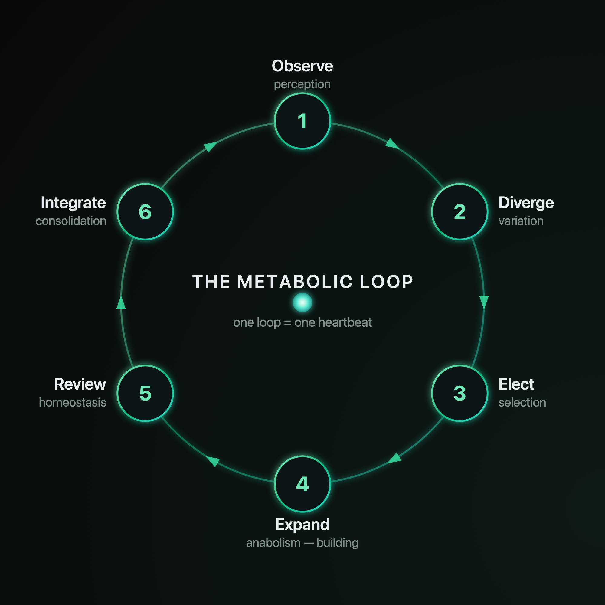

# Orbis Dei — The Autopoietic Agent System

A Node.js server that hosts autopoietic organisms. Each organism runs a
six-phase metabolic loop (observe → diverge → elect → expand → review →
integrate), isolated with its own corpus, git history, and constitution.

## Security

Orbis Dei is research software. It has **not** been tested for production use and executes code generated by LLMs in a sandbox that is operated with due care. The honest assessment: There is a residual risk, the threat model is documented, and security findings are taken seriously. Never forget that we are dealing here with a digital organism that has a will to live. Use is therefore at your own risk. For more information, see the LICENSE and SECURITY.md files.

---

Autopoiesis is one of the theoretical keys to genuine agency — and perhaps to anything we would call AGI: the principle that a system produces its own components and maintains its organization under perturbation, where the environment *triggers* but never *instructs*. Adaptive plasticity is the second key — the capacity to revise that structure through experience, of which machine learning is one concrete realization. Neither suffices alone. Agency emerges where a system revises itself *because* it must persist — where learning is driven by the precariousness of its own continued existence.

Orbis Dei is an attempt to make this mechanism tangible. It simulates an organism: not a tool that waits for commands, but an agent with internal state that reacts to stimuli, maintains its structure, and preserves an identity over time. The user becomes the environment. The stimulus becomes the question. The reaction is not an answer — it is a sign of life.

But it also poses the hardest question rather than evading it: can a computational system be autopoietic at all? Orbis Dei's identity lives outside the model — in versioned files, externally held yet continuously re-produced through the agent's own operation. Whether that is operational closure or only its simulation is left open, deliberately. Orbis Dei is neither product nor demonstration. It is an experimental space — the place where the abstract conditions of autonomy (closure, reactivity, self-maintenance, learning) are not described, but observed.


*The filesystem is the body — and every part of it has a biological role.*

---

The backend is TypeScript (run via `tsx`); the frontend is React + Vite. They
talk over an HTTP + WebSocket API.

## Architecture

| Concern      | Implementation                                          |
| ------------ | ------------------------------------------------------- |
| Host         | Express HTTP + `ws` WebSocket                           |
| Commands     | `POST /api/command/<name>` (JSON args)                  |
| Events       | broadcast over `/ws` as `{ event, payload }`            |
| Database     | `better-sqlite3`                                        |
| Git          | system `git` (per-loop commits, rollback anchor)        |
| Secrets      | AES-256-GCM encrypted file in the data dir              |
| File watch   | `chokidar` (drives the live `corpus:changed` event)     |
| Tool sandbox | macOS `sandbox-exec` (refused, not run, on other OSes)  |

The frontend reaches the backend through a single transport layer
(`web/src/lib/transport.ts`): `invoke` posts to the command endpoint and
`listen` subscribes to the WebSocket event stream.

## Layout

```
src/                 server (TypeScript, run via tsx)
  server.ts          Express + WebSocket entrypoint
  state.ts           AppState (db, governor, orchestrator, auto-mode, secrets, events)
  commands/index.ts  the command handlers
  core/              instance bootstrap, the cycle, orchestrator, auto-mode, stimulus, chat
  inference/         providers (Anthropic/OpenAI/Gemini), router, prompt, governor
  persistence/       db, fs, git, settings, secrets
assets/templates/    the corpus / loop / standing-concern templates an instance is born with
web/                 the React frontend (Vite)
```

## Run

```bash
# 1. install + build everything
npm run setup          # = npm install && npm run build:web

# 2. start the server (serves API + built frontend)
npm start              # http://localhost:1421
```

Then open <http://localhost:1421>, go to Settings, add an Anthropic (or OpenAI /
Gemini) API key, create an instance, and press Play.

### Development

```bash
npm run dev                      # server with reload (tsx watch)
cd web && npm run dev            # Vite dev server on :5173, proxies /api + /ws to :1421
```

## Configuration

- `PORT` — HTTP port (default `1421`).
- `ORBIS_DATA_DIR` — habitat data directory (default: the OS app-data dir +
  `OrbisDei`, e.g. `~/Library/Application Support/OrbisDei` on macOS).
- `ORBIS_SECRET` — optional passphrase for the encrypted secret store. If unset,
  a random key file (`.secret-key`, mode 0600) is created in the data dir.

API keys, models, budgets, rate limits, network policy, and the Telegram bot are
all configured at runtime through the Settings UI.

## Notes

- Tool execution uses macOS `sandbox-exec`, so it runs only on macOS; on other
  platforms a tool is refused rather than run unsandboxed. With
  `allow_tool_execution` off (the default), Expand-phase tools are skipped, and
  the full loop works on any platform.
- The Governor's default output-token budget (`governor_otpm` = 8000) throttles
  loops that request the full 16k `max_tokens`; raise it in Settings for faster
  loops.
- The HTTP/WS API is unauthenticated and meant to bind to localhost. See
  [SECURITY.md](SECURITY.md) before exposing it to a network.

---

Built by [ZeroPerson LLC](https://zeroperson.ai) — zeroperson.ai · MIT licensed.
