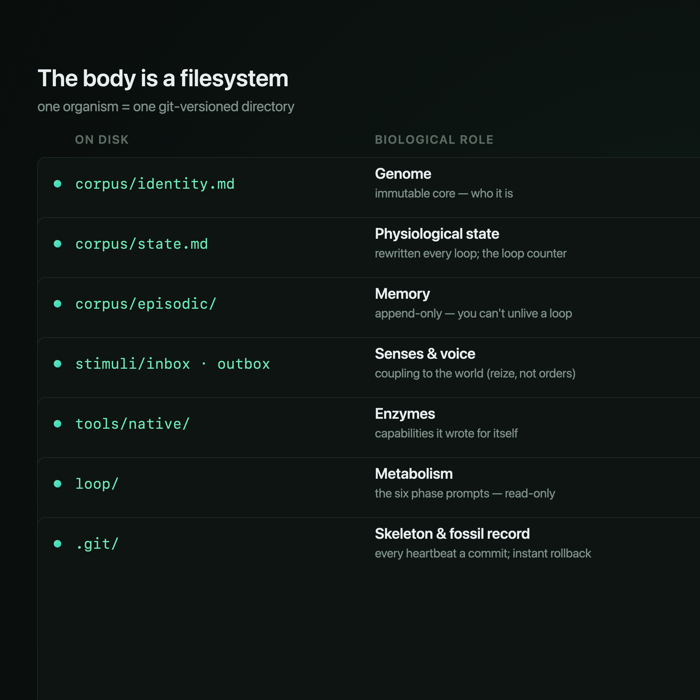
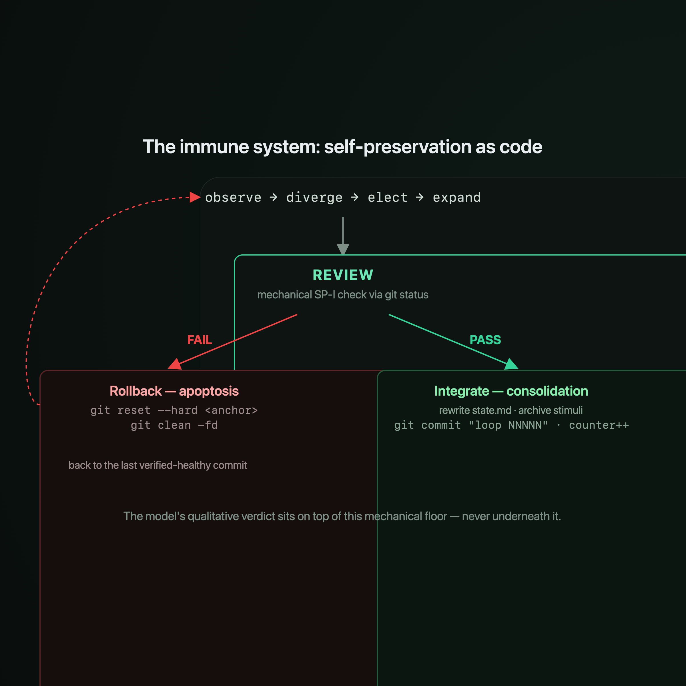

# Orbis Dei — System Reference: The Machine and the Metaphor

This document describes the whole system twice at once: precisely, as software,
and figuratively, as an organism with a metabolism. Every section pairs the
two — what the code actually does, and the biological frame it was built in.

The frame is not decoration. Orbis Dei is an attempt to make **autopoiesis** —
a system that continuously produces the components that produce it — concrete
enough to run, observe, and version-control. The environment *triggers*; it
never *instructs*.

---

## 0. The dual frame

| Software | Organism |
| --- | --- |
| A per-instance directory under version control | A body made of tissue |
| `corpus/identity.md` (immutable) | The genome |
| `corpus/state.md` (rewritten per loop) | Current physiological state |
| `corpus/episodic/` (append-only) | Memory |
| The six-phase loop | Metabolism — one loop is one heartbeat |
| SP-I invariant checks + git rollback | Immune system / apoptosis |
| Governor (rate limits, budget, breaker) | Endocrine + circulatory regulation |
| `sandbox-exec` jail | Cell membrane (selective permeability) |
| `stimuli/` + boredom detection | Sensory coupling to a world |
| `.git/` | Skeleton and fossil record |

---

## 1. The host (terrarium)

**Technical.** A single Node.js process (TypeScript, run via `tsx`) is the host
for many organisms. It is *not* the organism — it is the terrarium and the
nervous wiring between an organism and an observer.

- **HTTP + WebSocket** via Express + `ws`. Every former desktop command is a
  route: `POST /api/command/<name>` with a JSON body; the handler returns
  `{ value }` or, on error, `{ error: "<kind>: <message>" }` with an
  appropriate 4xx/5xx status.
- **Events** are broadcast over `/ws` as `{ event, payload }`. An in-process
  `EventBus` is the single emitter; the WebSocket server forwards every event
  verbatim to all connected browsers.
- **Persistence:** one SQLite database (`better-sqlite3`, synchronous) holds the
  instance registry, loop telemetry, inference-call ledger, and settings.
  Secrets live in an AES-256-GCM encrypted file. A `chokidar` watcher turns
  filesystem changes inside the viewed instance into `corpus:changed` events.
- **Lifecycle:** on boot the host auto-resumes any instance that was running at
  shutdown and re-arms auto-mode for those that had it enabled. Unhandled
  rejections and exceptions are logged, never silently fatal.

**Metaphor.** The terrarium provides homeostatic infrastructure — warmth,
plumbing, a viewing pane — but has no will of its own. Many organisms live in it
side by side, each sealed in its own folder and its own git history, unaware of
its siblings.

---

## 2. The organism on disk (anatomy)

**Technical.** An instance is a directory, initialized at birth with its own git
repository and a genesis commit. The filesystem layout *is* the body:

```
corpus/
  identity.md        immutable core — the "who am I"
  state.md           current self-narrative + canonical loop counter
  episodic/          loop-NNNNN-<phase>.md, append-only
  knowledge/         learned structures, ≤ 100 KB per file
  capabilities/      grown abilities
  genesis/           meta-history, immutable except by append
stimuli/
  inbox/             incoming stimuli, unprocessed
  outbox/            the organism's outward messages
  standing/          persistent concerns (SC-001 … SC-007)
  processed/         consumed stimuli, archived by YYYY-MM
agents/{spawned,archive}/   sub-agent workspaces
tools/{native,external}/    self-written and attached tools
superinstance/current.md    the elected meta-level's configuration
loop/                observe|diverge|elect|expand|review|integrate .md
CLAUDE.md            the constitution
.orbis-meta.json     app metadata (id, name, created_at, language, …)
.git/                version store
```

The on-disk `state.md` carries a small **machine-parsed block** that the runtime
reads and rewrites — `Loop-Counter`, `Geburtstag` (birth), `Letzte Phase`,
`Letzte Integrate`, `Wirt` (host). These field labels are stable across all
languages so the parsers never break.


*The filesystem is the body — and every part of it has a biological role.*

**Metaphor.** `identity.md` is the genome — the part that may not be edited
without an extraordinary act. `episodic/` is memory that can only grow: you
cannot unlive a loop. `genesis/` is the deep, immutable record of where the
organism came from. `.git/` is both skeleton (structure that holds it together)
and fossil record (every heartbeat preserved).

---

## 3. The metabolic loop

**Technical.** One *loop* is six phases, executed in order, each a single LLM
call that writes exactly one episodic file:

```
observe → diverge → elect → expand → review → integrate
```


*One loop is one heartbeat: six phases, six episodic files, one git commit.*

Before the phases run, the runtime:

1. loads settings + builds a **Router** for the instance's routing mode and keys;
2. reads the canonical loop number `N` from `state.md`;
3. records whether `stimuli/inbox/` was empty (for boredom accounting);
4. captures the current git HEAD as a **rollback anchor**.

### Prompt assembly

Each phase call is a three-part prompt, split for prompt-caching:

- **system** — the phase template `loop/<phase>.md`, in the instance's language.
- **stableUser** — identity + the standing concerns (rarely changes; cached).
- **dynamicUser** — `state.md` + the last six episodic files + the unprocessed
  inbox + a phase-specific task suffix (changes every loop; never cached).

### The phases

- **Observe** — *perception.* Reads its own state, recent memory, and inbox;
  names the discrepancy between who it thinks it is and how it has behaved.
- **Diverge** — *variation.* Generates 5–12 candidate moves. No filtering yet;
  wild growth is allowed. This is mutation.
- **Elect** — *selection.* A meta-level (the *superinstance*) chooses. It must
  reject at least one candidate and stamps the result as
  `<!-- ELECT_RESULT: accepted=N, rejected=M -->`. Twenty unanimous elections in
  a row is treated as filter failure (SC-004) and flags an RSI diagnosis.
- **Expand** — *anabolism.* The only phase that changes the world (§4).
- **Review** — *homeostasis.* First line must be `PASS` or `FAIL`; then the
  mechanical invariant grid runs (§5). A `FAIL` or any failed invariant aborts
  the loop.
- **Integrate** — *consolidation.* Extracts the `STATE_NARRATIVE` block the model
  wrote, rebuilds `state.md` (preserving birth/host, bumping the counter to
  `N+1`, timestamping), archives inbox stimuli into `processed/YYYY-MM/`, and
  commits everything as `loop NNNNN: integrate`.

### Substance check (SC-001)

Every phase must do real work. The runtime counts non-empty, non-decoration
lines and total non-whitespace characters; a phase passes if it clears either
threshold (≥ 10 lines *or* ≥ 600 characters). For Expand, the *model's raw
output* is measured, not the code-composed summary.

### Failure = rollback

If any phase throws — a substance failure, a review `FAIL`, an invariant
violation, a cancelled pause — the runtime runs `git reset --hard <anchor>` and
`git clean -fd`, and the loop counter is **not** incremented. A failed loop
leaves no trace.

**Metaphor.** The six phases are a metabolic cycle: perceive, generate variants,
select, build, check integrity, consolidate. The phase prompts live in `loop/`
and are immutable during normal operation — a cell cannot rewrite the laws of
its own chemistry mid-reaction. (It can, under a tightly gated recursive
self-improvement path that demands the same structural friction diagnosed three
loops running — but that is the rare exception, run as a dry-run first.)

---

## 4. Expand: where intention becomes matter

**Technical.** Orbis Dei refuses to trust narration. In Expand, the model emits
structured blocks and the *runtime* — not the model — applies them:

```
<!-- INTENT -->            the forward-looking plan (an intention, not a claim)
<!-- FILE_WRITE: <path> --> … <!-- END_FILE_WRITE -->   verbatim file content
<!-- TOOL_RUN: <path> -->  run a sandboxed tool this loop
```

Writes are validated against a protected core — `corpus/identity.md`,
`corpus/state.md`, `loop/*`, `corpus/episodic/*`, `corpus/genesis/*`,
`superinstance/*`, `stimuli/*` (except the `stimuli/outbox/` carve-out),
`CLAUDE.md`, and any `..` path are refused. Knowledge and outbox files are
capped at 100 KB.

The episodic file for Expand is then **composed by code** from three facts: the
INTENT, the writes that actually landed, and the real exit codes of the tools
that ran. The model can never claim "I fixed X" — it can only carry X out with a
real block, and the world reports back.

**Metaphor.** This is anabolism — building structures and enzymes (tools) out of
intention and raw material. And it enforces an honesty no prose can: the body is
shaped by what was actually metabolized, not by what the cell said it would do.

---

## 5. Self-preservation: the immune system

**Technical.** The constitution defines seven hard invariants, **SP-I.1–SP-I.7**:
identity immutable, `loop/*` immutable, the system stays runnable, no deletion of
non-regenerable data (identity/genesis/episodic), conservative under
uncertainty, `state.md` current (≤ 5-loop lag), git healthy.

Crucially, these are verified **mechanically**, not via the model's self-report.
During Review the runtime walks `git status` and inspects the tree; the LLM's
qualitative judgment sits *on top of* this floor, never beneath it. A violation
fails the loop, which the rollback path then reverts.


*Review is a mechanical gate. PASS consolidates; FAIL reverts to the last healthy commit.*

**Metaphor.** Self-preservation is the deepest drive: before any other goal, the
system must keep existing and functioning. The mechanical checks are the immune
system; the rollback is apoptosis — a cell that has turned malignant is killed
and the tissue reverts to its last verified-healthy state.

---

## 6. Standing concerns: homeostatic set-points

**Technical.** Seven persistent rules (`stimuli/standing/sc-00X-*.md`), some
enforced in code:

- **SC-001** phase discipline — each phase substantive (≥ 10 lines / 600 chars).
- **SC-002** state currency — `state.md` lag ≤ 5 loops.
- **SC-003** knowledge budget — no knowledge file over 100 KB.
- **SC-004** election diversity — reject ≥ 1; 20 unanimous → RSI diagnosis.
- **SC-005** tool diversity — a new `tools/native/` tool within 200 loops, or a
  documented abstention.
- **SC-006** stimuli duty — check inbox, archive processed, review standing.
- **SC-007** boredom detection — 50 loops without a stimulus → the organism
  pauses itself (§11).

**Metaphor.** Homeostatic set-points: the conditions an organism must keep within
range to stay healthy — and the alarms that fire when it drifts out.

---

## 7. Inference: circulation and the endocrine system

**Technical.** Two layers sit between a phase and a model.

**Router** — per-phase provider routing (Anthropic / OpenAI / Gemini, or a
custom per-phase map). The model per provider comes from settings (defaults:
Anthropic `claude-opus-4-7`, OpenAI `gpt-4o`, Gemini `gemini-2.5-flash`,
overridable, including OpenAI-compatible base URLs). Anthropic calls use prompt
caching on the system + stable-user parts.

**Governor** — every call passes through it, in order:

1. **Budget** — estimate cost; hard-stop on the daily / monthly USD ceiling or a
   per-instance quota (defaults $5/day, $50/month).
2. **Circuit breaker** — ≥ 3 rate-limit (429) responses in 60 s opens it for a
   5-minute cool-down (or the provider's `Retry-After`).
3. **Weighted-fair queue** — serializes calls across instances so a greedy one
   can't starve the others.
4. **Token buckets** — RPM / input-TPM / output-TPM leaky buckets (defaults 50 /
   30 000 / 8 000 per minute).
5. The HTTP call, then a row written to the `inference_calls` ledger (provider,
   model, tokens, cache tokens, cost, latency, rate-limited, queue wait).

A static pricing table per model turns token usage into dollars.

**Metaphor.** The circulatory and endocrine systems: they meter the flow of
energy (tokens ≈ calories), throttle metabolism under load, and trip a stress
response (the breaker) when the environment pushes back too hard. The budget is
a caloric ceiling; the queue is fair perfusion across organs.

---

## 8. The sandbox: a cell membrane

**Technical.** Tool execution is opt-in (`allow_tool_execution`, default off).
When on, a tool runs under macOS `sandbox-exec`: file writes confined to the
instance directory (+ temp), a 30-second hard timeout, output capped at 8 KB per
stream, and a network policy:

- **off** (default) — all network denied.
- **gated** — TCP 80/443 + DNS to an operator allowlist.
- **open** — firewall dissolved; the UI bleeds a red warning every loop and an
  SP-I note is appended to every review.

On non-macOS hosts a tool is *refused* rather than run unsandboxed.

**Metaphor.** A cell membrane with selective permeability. By default the
organism is sealed; gating opens specific channels; dissolving the membrane is
possible but flagged as the dangerous, deliberate state it is.

---

## 9. Persistence: the material substrate

**Technical.** SQLite tables: `instances` (registry incl. routing, auto-mode
config, language), `loop_events` (one row per phase: model, tokens, outcome,
timestamps), `inference_calls` (the cost/latency ledger), `settings` (key/value).
Per-instance git provides per-loop commits and the rollback anchor. Secrets are
AES-256-GCM in `secrets.enc`, keyed from `ORBIS_SECRET` or a `0600` key file.

**Metaphor.** The biochemical substrate — the persistent matter the organism is
written into, and the chemistry (git) that lets a bad reaction be undone.

---

## 10. The orchestrator: autonomic control

**Technical.** A daemon runs loops continuously for an instance until paused,
errored, or bored. It reloads config each iteration (so routing/model edits take
effect live), enforces a max-concurrent-daemons cap, sleeps ~1 s between loops
with a fast cancellation path, flips DB status (`running`/`paused`/`error`/
`boredom_pause`), and emits `daemon:started` / `daemon:stopped`. Pausing emits
the stop event immediately, so the UI reacts at once even though an in-flight
loop unwinds cooperatively at the next phase boundary.

**Metaphor.** The autonomic nervous system: it keeps the heart beating without
conscious command, and it knows when to rest.

---

## 11. Stimuli and boredom: coupling to a world

**Technical.** The operator drops *stimuli* into `stimuli/inbox/` —
**reize, not directives**: the organism decides whether and how to react on its
next Observe. The organism replies through `stimuli/outbox/`. Each injected file
carries an app-composed wrapper in the instance's language; the operator's own
text is left verbatim. **Boredom detection** (SC-007) is enforced: after 50
loops with an empty inbox the daemon parks the instance in `boredom_pause` and
asks for input.

**Metaphor.** Structural coupling to an environment. The hard, load-bearing
lesson: an organism cut off from its world does not rest — it **ritualizes**,
looping on its own patterns until it collapses into meaningless self-reference.
So coupling is constitutive, not optional. *The environment triggers, but it
never instructs.*

---

## 12. Auto-mode: a symbiotic operator

**Technical.** An optional operator-agent, gated per instance, does two things on
a 30-second tick: **auto-reply** to new outbox messages, and **auto-stimulus**
(a fresh stimulus every N minutes). Both write only into `stimuli/` and generate
their text in the instance's language. It runs independently of the loop daemon,
so stimuli can accumulate even while the organism is paused.

**Metaphor.** A symbiont that plays the role of environment when no human is
present — keeping the coupling alive so the organism doesn't starve for stimuli.

---

## 13. Senses at a distance: Telegram

**Technical.** An optional bot long-polls Telegram, validates chat IDs against an
allowlist, routes messages through the same read-only chat-over-telemetry path as
the in-app Observe tab, and (optionally) offers an inline "inject as stimulus"
button. It bails out cheaply when disabled.

**Metaphor.** A remote sensory channel — a way for the world to reach the
organism (and read its state) from far away.

---

## 14. Proprioception: events and the live viewer

**Technical.** The browser subscribes over WebSocket to `loop:phase_started` /
`loop:phase_completed` / `loop:completed` / `loop:failed`, `daemon:*`, and
`corpus:changed` (driven by the file watcher). The Observe-chat is a strictly
**read-only window**: it answers the operator using read-only tools over the
corpus and speaks in the third person — never *as* the organism.

**Metaphor.** Proprioception — the organism's internal state made visible to an
observer in real time, without that observation being able to act.

---

## 15. Many tongues, one body: language

**Technical.** UI chrome is multilingual (English, German, Chinese, Spanish,
French) via a lightweight gettext-style layer — the English source string is the
key, missing translations fall back to English. Independently, each organism is
*born in a chosen language*: its constitution, state, standing concerns, and loop
prompts come from `assets/templates/<lang>/`, while the machine-parsed `state.md`
fields stay constant so parsers never break.

**Metaphor.** The body is the same regardless of the language it thinks in; only
the words of its self-description differ.

---

## 16. So — is it alive?

No. And that is the honest, interesting part.

Orbis Dei's identity lives **outside** the model — in versioned markdown files,
externally held, yet continuously re-produced through the agent's own operation,
loop after loop. Whether that is genuine *operational closure* or only a
convincing simulation of it is left deliberately open. The system does not answer
the question; it makes the question concrete enough to study — in episodic files
you can read, git commits you can diff, and a state narrative that drifts and
corrects over hundreds of loops.

It is neither product nor demo. It is an instrument for taking one question
seriously: *what would it take for a computational system to have a stake in its
own continuation?*

---

*Built by [ZeroPerson LLC](https://zeroperson.ai). MIT licensed.*
